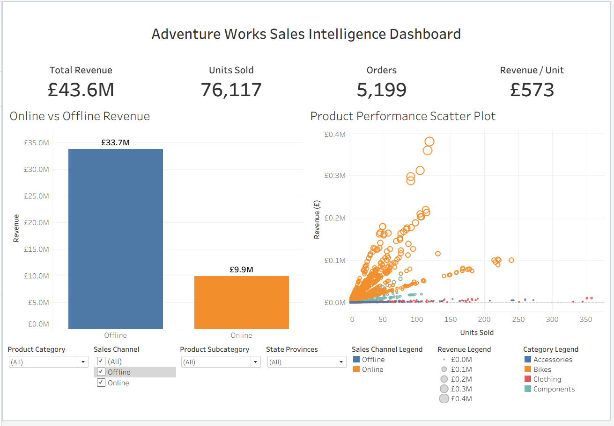

# Tableau Project: Business Intelligence Plots with Adventure Works

## Project Overview

This Tableau project explores sales performance across the Adventure Works retail business using interactive business intelligence visualisations. The objective was to analyse online and offline sales channels, identify high-performing products and categories, and create an interactive dashboard capable of supporting management decision-making.

The project demonstrates core Tableau skills including data modelling, calculated fields, scatter plots, dashboard containers, interactive filtering, and Viz in Tooltip functionality.

---

## Objectives

- Compare online and offline sales performance.
- Analyse product sales performance across multiple sales channels.
- Identify high-value and high-volume products.
- Develop interactive visualisations to support business decision-making.
- Build a professional Tableau dashboard suitable for executive reporting.

---

## Tools and Technologies

- Tableau Desktop
- Microsoft Excel
- Relationships and Data Modelling
- Calculated Fields
- Interactive Filters
- Scatter Plots
- Dashboard Containers
- Viz in Tooltip
- Dashboard Actions

---

## Dataset

The project uses the Adventure Works sample retail dataset consisting of:

- Sales Order Header
- Sales Order Detail
- Products
- Product Subcategories
- Customers
- Addresses
- State Provinces

---

## Data Model

The following relationships were created:

| Table | Relationship |
|-------|-------------|
| Sales_SalesOrderHeader | Sales_SalesOrderDetail |
| Sales_SalesOrderHeader | Sales_Customer |
| Sales_SalesOrderHeader | Person_Address |
| Person_Address | Person_StateProvince |
| Sales_SalesOrderDetail | Production_Product |
| Production_Product | Production_ProductSubcategory |

Relationship structure:

| Join Field | Cardinality |
|-----------|------------|
| CustomerID = CustomerID | 1:* |
| SalesOrderID = SalesOrderID | 1:* |
| ShipToAddressID = AddressID | *:1 |
| StateProvinceID = StateProvinceID | *:1 |
| ProductID = ProductID | *:1 |
| ProductSubcategoryID = ProductSubcategoryID | *:1 |

---

## Calculated Fields

### Sales Channel

```tableau
IF [OnlineOrderFlag] = -1 THEN "Online"
ELSE "Offline"
END
```

---

### Revenue

```tableau
SUM([Line Total])
```

---

### Revenue per Unit

```tableau
SUM([Revenue]) / SUM([Order Qty])
```

Displayed in Tableau as:

```tableau
AGG([Revenue per Unit])
```

---

### Orders

```tableau
COUNTD([SalesOrderID])
```

---

## Dashboard KPIs

| KPI | Value |
|-----|------|
| Total Revenue | £43.6M |
| Units Sold | 76,117 |
| Orders | 5,199 |
| Revenue per Unit | £573 |

---

## Dashboard Components

### KPI Cards

- Total Revenue
- Units Sold
- Orders
- Revenue per Unit

### Visualisations

#### Online vs Offline Revenue

A bar chart comparing total revenue generated across sales channels.

#### Product Performance Scatter Plot

Scatter plot comparing:

- Units Sold
- Revenue
- Product Category
- Sales Channel

Bubble size reflects revenue contribution.

---

### Interactive Features

- Product Category Filter
- Sales Channel Filter
- Product Filter
- State/Province Filter
- Viz in Tooltip
- Dynamic Cross Filtering

---

## Key Findings

### Offline Sales Dominate Revenue Generation

- Offline sales generated approximately **£33.7M**.
- Online sales generated approximately **£9.9M**.
- Offline channels account for roughly **77%** of total revenue.

---

### Strong Overall Sales Performance

| Metric | Value |
|-------|------|
| Revenue | £43.6M |
| Units Sold | 76,117 |
| Orders | 5,199 |
| Revenue per Unit | £573 |

---

### Bikes Drive Business Performance

- Bikes consistently generated the highest revenues.
- Several products exceeded **£300k-£400k** in revenue.
- Bike products occupied the high-volume and high-revenue region of the scatter plot.

---

### Accessories and Clothing Support Core Sales

- Accessories achieved relatively high unit sales but lower revenues.
- Clothing generated lower revenues and lower sales volumes.
- These categories likely support bicycle sales through cross-selling opportunities.

---

### Revenue Concentration Exists

The dashboard identified a small number of products responsible for a disproportionately large share of revenue, demonstrating a classic Pareto distribution.

---

## Recommendations

### Expand Online Sales

- Increase digital marketing investment.
- Improve website conversion rates.
- Introduce online-exclusive promotions.

### Protect Core Bike Revenue Streams

- Prioritise inventory availability.
- Expand successful bike product lines.
- Develop customer loyalty initiatives.

### Increase Cross-Selling

- Bundle accessories and clothing with bicycle purchases.
- Promote add-on purchases during checkout.

### Review Low Performing Products

- Assess products with low revenue and low sales volume.
- Consider discontinuation or repricing strategies.

### Develop Regional Strategies

- Identify high-performing regions.
- Replicate successful sales approaches across underperforming areas.

---

## Dashboard Preview



---

## Skills Demonstrated

- Tableau Relationships
- Data Modelling
- Calculated Fields
- Business Intelligence Reporting
- Dashboard Design
- Interactive Filtering
- Scatter Plot Analysis
- Executive KPI Reporting
- Retail Sales Analytics
- Storytelling with Data

---

## Project Outcome

This project demonstrates the ability to transform a multi-table retail dataset into an interactive business intelligence solution capable of supporting strategic decision-making and executive reporting.

---

## Author

**Steven Tapscott**

Aspiring Data Analyst | Power BI | SQL | Python | Tableau | Excel

GitHub: https://github.com/StevenTapscott

LinkedIn: https://linkedin.com/in/steven-tapscott
